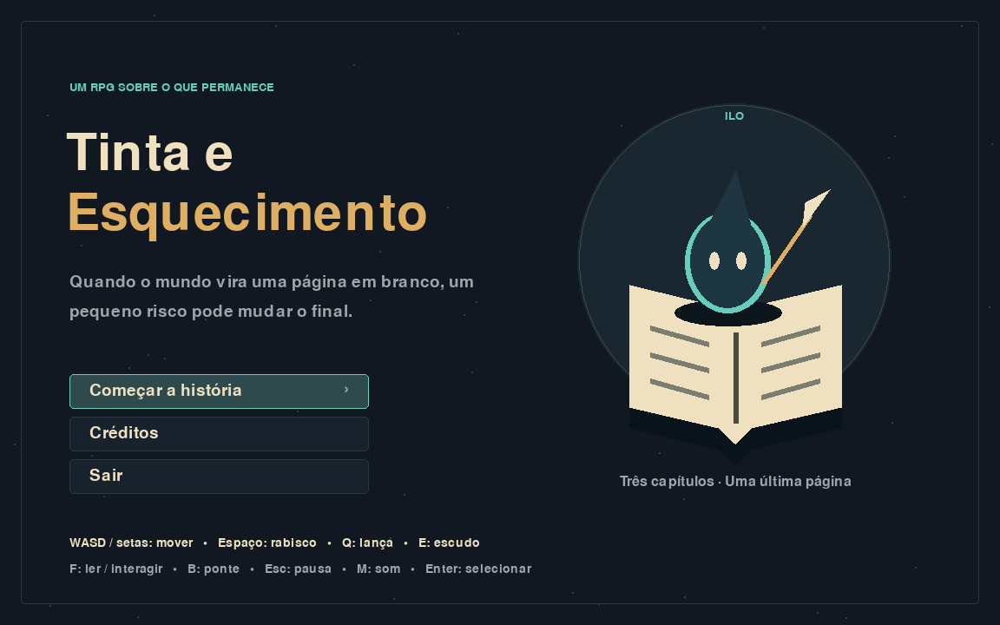

# Tinta e Esquecimento

Uma biblioteca está sendo apagada pelo Vazio. Ilo, uma criatura de tinta nascida de um livro inacabado, precisa reunir histórias e enfrentar O Revisor antes que a última página desapareça.

**Demo 0.1 de RPG de ação 2D, com três fases**, feita em Python e Pygame. Esta é a primeira versão jogável: arte geométrica original, efeitos sintetizados e regras completas do início ao final. Os assets enviados inicialmente ainda não foram integrados; veja [CREDITOS.md](CREDITOS.md).



## Jogar no Windows sem instalar Python

Abra [Releases](https://github.com/stopalltime-ship-it/tinta-e-esquecimento/releases), escolha a demo mais recente e baixe `Tinta-e-Esquecimento-Windows.zip`. Extraia todo o ZIP e execute `TintaEEsquecimento.exe`. As pastas `assets` e `_internal` devem permanecer ao lado dele. A disponibilidade da build depende da conclusão bem-sucedida do workflow em [Actions](https://github.com/stopalltime-ship-it/tinta-e-esquecimento/actions).

## Executar no VS Code

1. Instale Python **3.12 de 64 bits**, VS Code e a extensão Python da Microsoft.
2. Baixe o código em **Code → Download ZIP** e extraia, ou clone este repositório.
3. Abra a pasta que contém `main.py` no VS Code.
4. No Windows, execute `preparar_windows.bat` uma vez para criar o ambiente e instalar Pygame. Precisa de internet nessa preparação.
5. Em **Ctrl+Shift+P → Python: Select Interpreter**, selecione `.venv\Scripts\python.exe`.
6. Pressione **F5** ou abra `jogar.bat`.

Alternativa pelo terminal do Windows, sem depender de ativação de scripts no PowerShell:

```powershell
py -3.12 -m venv .venv
.venv\Scripts\python.exe -m pip install -r requirements.txt
.venv\Scripts\python.exe main.py
```

Em Linux/macOS com Python 3.12:

```sh
python3 -m venv .venv
.venv/bin/python -m pip install -r requirements.txt
.venv/bin/python main.py
```

## Controles

| Tecla | Ação | Tinta |
|---|---|---:|
| WASD / setas | Mover e apontar os ataques | 0 |
| Espaço | Rabisco curto | 6 |
| Q | Lança de tinta | 18 |
| E | Escudo por 3 segundos | 24 |
| B | Desenhar ponte por 8 segundos nas bordas marcadas | 20 |
| F | Ler, interagir ou escrever no círculo | 0 |
| Esc | Pausar | 0 |
| M | Ligar/desligar efeitos sonoros | 0 |
| Enter | Confirmar menu e continuar textos | 0 |

Livros verdes recuperam até 65 de tinta e 20 de vida por leitura. São reutilizáveis após quatro segundos de jogo. O tempo pausa durante a leitura. Fragmentos recuperam 12 de tinta; inimigos derrotados recuperam 8. Não há salvamento entre sessões.

## Três capítulos

1. **Sala de Contos Infantis:** aprender os controles, recuperar três fragmentos dourados e interagir com o livro à direita.
2. **Arquivo dos Versos e Mapas:** atravessar duas fendas desenhando pontes, recuperar os fragmentos e alcançar o livro. Se a ponte expirar sob Ilo, ele retorna à margem, com possível perda de vida.
3. **A Última Página:** coletar três fragmentos e usar F no círculo central. A história completa quebra a proteção do Revisor. Ele continua apagando lanças e escudos a cada sete segundos. Derrote-o e assine a última página.

**Vitória:** derrotar o chefe após completar a história e concluir a assinatura. **Derrota:** vida chegar a zero; é possível reiniciar a fase atual. O nome digitado é apenas exibido localmente e não é salvo nem enviado.

## Como o código está organizado

| Arquivo | Responsabilidade |
|---|---|
| `main.py` | Inicialização e opções de verificação |
| `game/app.py` | Eventos, loop, menus e estados de jogo |
| `game/world.py` | Classes, colisões, inimigos, ataques e condições de vitória/derrota |
| `game/render.py` | Desenhos e interface usando primitivas do Pygame |
| `game/audio.py` | Efeitos sonoros sintetizados em memória |
| `game/settings.py` | Configurações e caminhos relativos ao projeto/executável |
| `assets/story.json` | Texto original das fases e leituras |
| `tests/test_game.py` | Verificação das regras e transições |
| `build_windows.py` | Testes, empacotamento Windows e criação do ZIP |

Para estudar: comece por `main.py`, acompanhe `Game.run()`, depois os eventos em `Game.event()`. Em `World.update()`, observe como o tempo (`dt`), as listas de entidades e as condições atualizam o jogo. O desenho ocorre depois, em `Renderer.game()`.

## Gerar a entrega da faculdade

No Windows, com o ambiente preparado:

```powershell
.venv\Scripts\python.exe -m pip install -r requirements-build.txt
.venv\Scripts\python.exe build_windows.py
```

O resultado será `dist/Tinta-e-Esquecimento-Windows.zip`, contendo o `.exe`, as dependências e `assets`. **O ZIP do código-fonte não substitui essa entrega compilada.** PyInstaller deve executar em Windows para gerar o executável Windows. O workflow também compila, testa e publica o ZIP automaticamente a cada atualização de `main`.

## Verificações

```sh
python -m unittest discover -s tests -v
python main.py --smoke-test
python main.py --smoke-test --scene chefe
```

Os testes verificam colisões, tinta, escudo, pontes, fragmentos, vulnerabilidade do chefe, leitura, derrota e transições. O teste de abertura usa vídeo/áudio simulados e não substitui testar com teclado e som no computador de destino.

## Autoria e escopo

Projeto desenvolvido com assistência de IA, a partir da proposta de Emerson. O enunciado exige código próprio: confirme a política de uso de IA, estude e adapte a implementação antes da entrega. Não é uma cópia de outro jogo ou repositório.

A demo não inclui inventário, progressão por XP, salvamento, música ambiente ou assets baixados. Esses recursos não são necessários para o recorte aprovado. Consulte [CREDITOS.md](CREDITOS.md) para as origens e licenças.
