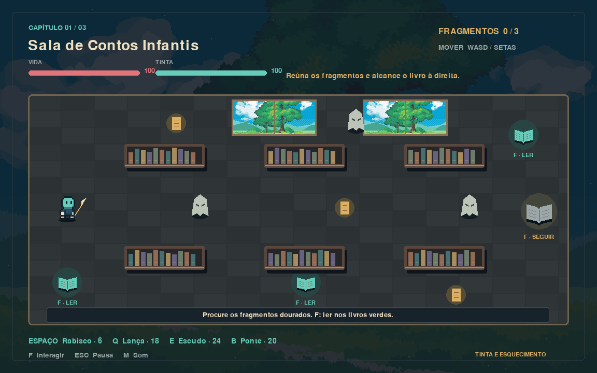

# Tinta e Esquecimento

Uma biblioteca está sendo apagada pelo Vazio. Ilo, uma criatura de tinta nascida de um livro inacabado, precisa reunir histórias e enfrentar O Revisor antes que a última página desapareça.

**Demo 0.2 de RPG de ação 2D, com três fases**, feita em Python e Pygame. Integra o personagem animado Classic Hero, três cenários e três dos sons enviados em Mygame.7z, além da biblioteca e dos efeitos desenhados em código. Veja a origem, as adaptações e as licenças em [CREDITOS.md](CREDITOS.md).




## Executar no VS Code

**Para VS Code, baixe `Tinta-e-Esquecimento-Fonte.zip` na [release mais recente](https://github.com/stopalltime-ship-it/tinta-e-esquecimento/releases/latest).** Esse pacote contém `main.py`, a pasta `game`, os recursos em `assets` e a configuração do editor. O jogo abre em uma janela do Pygame.

1. Instale Python **3.12 de 64 bits**, VS Code e as extensões **Python** e **Python Debugger** da Microsoft. No instalador do Python, inclua o Python Launcher ou marque **Add Python to PATH**.
2. Extraia **todo** o ZIP do fonte. Também é possível obter o código por **Code → Download ZIP** ou clonar este repositório.
3. No Windows, abra `preparar_windows.bat` uma vez e aguarde a mensagem **Pronto**. Ele cria `.venv` e instala Pygame. A primeira preparação precisa de internet.
4. Use **Arquivo → Abrir Pasta** no VS Code e escolha a pasta que **contém `main.py`**.
5. Pressione **F5** e escolha **Jogar Tinta e Esquecimento**, se solicitado. No Windows, a tarefa confere as dependências e inicia o jogo com o Python da `.venv`.

Para jogar sem abrir o editor, execute `jogar.bat` na pasta do código. Ele também prepara o ambiente quando necessário. `preparar_windows.bat` permite conferir a instalação separadamente. Não é necessário executar ou liberar o `.exe` para jogar por Python.

Se aparecer **Python não foi encontrado**, instale Python 3.12 e reinicie o VS Code. Se a preparação falhar, veja `logs/preparacao.txt`; se o jogo falhar depois, veja `logs/erro-jogo.txt`. Os arquivos de diagnóstico permanecem no computador. A configuração de F5 aponta explicitamente para o Python da `.venv`; o botão **Executar Arquivo Python** usa o interpretador selecionado no editor. Para esse botão, selecione `.venv/Scripts/python.exe` em **Python: Select Interpreter**.

Alternativa pelo terminal do Windows, sem depender de ativação de scripts no PowerShell:

```powershell
py -3.12 -m venv .venv
.venv\Scripts\python.exe -m pip install -r requirements.txt
.venv\Scripts\python.exe main.py
```

Em Linux/macOS com Python 3.12:

```sh
python3 -m venv .venv
.venv/bin/python -m pip install -r requirements.txt
.venv/bin/python main.py
```

## Jogar no Windows sem instalar Python

Baixe `Tinta-e-Esquecimento-Windows.zip` na [release mais recente](https://github.com/stopalltime-ship-it/tinta-e-esquecimento/releases/latest). Extraia todo o ZIP e execute `TintaEEsquecimento.exe`. As pastas `assets` e `_internal` devem permanecer ao lado dele. Esse pacote compilado não contém o projeto Python para VS Code.

O executável não tem assinatura digital. Um aviso de aplicativo desconhecido do SmartScreen pode ocorrer por falta de reputação; isso é diferente de uma detecção de ameaça pelo antivírus. [A Microsoft explica como esses avisos funcionam](https://learn.microsoft.com/en-us/windows/apps/package-and-deploy/smartscreen-reputation). Se houver bloqueio, mantenha a proteção ativa e anote o texto do alerta e o nome da ameaça, quando informado. Use o pacote **Fonte** para executar o jogo por Python enquanto o bloqueio é investigado. Os testes da build não garantem a aceitação de um antivírus específico.

Erros depois que o executável inicia geram um aviso e um diagnóstico em `logs/erro-jogo.txt` ao lado do executável. Se a pasta não permitir escrita, o aviso indica o local alternativo. Um bloqueio antes da inicialização impede que esse diagnóstico seja criado.

## Controles

| Tecla | Ação | Tinta |
|---|---|---:|
| WASD / setas | Mover e apontar os ataques | 0 |
| Espaço | Rabisco curto | 6 |
| Q | Lança de tinta | 18 |
| E | Escudo por 3 segundos | 24 |
| B | Desenhar ponte por 8 segundos nas bordas marcadas | 20 |
| F | Ler, interagir ou escrever no círculo | 0 |
| Esc | Pausar | 0 |
| M | Ligar/desligar efeitos e ambientação | 0 |
| Enter | Confirmar menu e continuar textos | 0 |

Livros verdes recuperam até 65 de tinta e 20 de vida por leitura. São reutilizáveis após quatro segundos de jogo. O tempo pausa durante a leitura; a ambientação continua em volume reduzido. Fragmentos recuperam 12 de tinta; inimigos derrotados recuperam 8. Não há salvamento entre sessões.

## Três capítulos

1. **Sala de Contos Infantis:** aprender os controles, recuperar três fragmentos dourados e interagir com o livro à direita.
2. **Arquivo dos Versos e Mapas:** atravessar duas fendas desenhando pontes, recuperar os fragmentos e alcançar o livro. Se a ponte expirar sob Ilo, ele retorna à margem, com possível perda de vida.
3. **A Última Página:** coletar três fragmentos e usar F no círculo central. A história completa quebra a proteção do Revisor. Ele continua apagando lanças e escudos a cada sete segundos. Derrote-o e assine a última página.

**Vitória:** derrotar o chefe após completar a história e concluir a assinatura. **Derrota:** vida chegar a zero; é possível reiniciar a fase atual. O nome digitado é apenas exibido localmente e não é salvo nem enviado.

## Como o código está organizado

| Arquivo | Responsabilidade |
|---|---|
| `main.py` | Inicialização e opções de verificação |
| `game/app.py` | Eventos, loop, menus e estados de jogo |
| `game/world.py` | Classes, colisões, inimigos, ataques e condições de vitória/derrota |
| `game/render.py` | Desenhos e interface usando primitivas do Pygame |
| `game/audio.py` | Efeitos sintetizados, confirmação de menu e ambientação OGG |
| `game/media.py` | Carregamento dos cenários e recorte, paleta e animação do personagem |
| `game/settings.py` | Configurações e caminhos relativos ao projeto/executável |
| `assets/story.json` | Texto original das fases e leituras |
| `tests/test_game.py` | Verificação das regras e transições |
| `build_windows.py` | Testes, empacotamento Windows e criação do ZIP |
| `build_source.py` | Pacote completo do código para VS Code |

Para estudar: comece por `main.py`, acompanhe `Game.run()`, depois os eventos em `Game.event()`. Em `World.update()`, observe como o tempo (`dt`), as listas de entidades e as condições atualizam o jogo. O desenho ocorre depois, em `Renderer.game()`.

## Gerar a entrega da faculdade

No Windows, com o ambiente preparado:

```powershell
.venv\Scripts\python.exe -m pip install -r requirements-build.txt
.venv\Scripts\python.exe build_windows.py
```

O resultado será `dist/Tinta-e-Esquecimento-Windows.zip`, contendo o `.exe`, as dependências e `assets`, além de `dist/Tinta-e-Esquecimento-Fonte.zip` para VS Code e `dist/SHA256SUMS.txt` para conferir a integridade dos downloads. **O ZIP do código-fonte não substitui essa entrega compilada.** PyInstaller deve executar em Windows para gerar o executável Windows. A build usa uma pasta de dependências e desativa UPX; isso não garante que o executável seja aceito pelo antivírus.

O workflow verifica a preparação e abertura do pacote de código em uma pasta com espaços, compila e verifica o executável, e publica os dois ZIPs automaticamente a cada atualização de `main`. A publicação depende da conclusão bem-sucedida do workflow em [Actions](https://github.com/stopalltime-ship-it/tinta-e-esquecimento/actions). Para gerar somente o pacote do código, execute `python build_source.py`.

## Verificações

```sh
python -m unittest discover -s tests -v
python main.py --smoke-test
python main.py --smoke-test --scene chefe
```

Os testes verificam colisões, tinta, escudo, pontes, fragmentos, vulnerabilidade do chefe, leitura, derrota, transições, abertura fora da pasta do projeto e diagnóstico de dependência ou recurso ausente. O teste de abertura usa vídeo/áudio simulados e não substitui testar com teclado e som no computador de destino.
